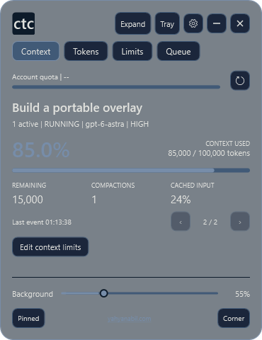

# Context-Token Codex

A Windows widget for Codex context, tokens, and account quotas.

**Windows 10/11 x64 · MIT · C# and WPF**

Created by [Yahya Nabil](https://yahyanabil.com). Independent community software.

## Download

[**Download the latest Windows release**](https://github.com/yahyaint/Context-Token-Codex/releases/latest)

1. Download the Windows ZIP and its SHA256 file.
2. Check the ZIP hash.
3. Extract the ZIP.
4. Open **Setup.exe**.

Setup creates shortcuts and keeps earlier versions and preferences.
The release includes .NET. A separate runtime installation is not required.
The executables are unsigned.

[Installation steps and one-prompt installation](INSTALL.md)

## Features

- **Context:** Recorded context use and compaction status for active chats.
- **Tokens:** Chat totals, token subsets, tool calls, and Exec details.
- **Limits:** Global and project settings, including idle projects.
- **Queue:** Saved limit changes and controls for a normal Codex restart.
- **Widget:** Compact, expanded, and parked views, tray restore, corner placement, and live background opacity.

Sample data.

## Edit context limits

Select **Edit context limits** or **Limits**.
Select a project or **Global - all projects**.

| Field | Example |
|---|---|
| Context window | `200000` or `200k` |
| Compact at | `180k` or `90%` |
| Remove an override | `default` |

Use **×1 / ×2 / ×3** to scale the displayed base.
Use **80% / 90% / 95%** to set a compaction threshold.
Select **Save limits** to store the values.

Settings apply to all models in the selected scope.
Loaded chats need a fresh Codex session.
Use **Queue** to check changes and request a restart after all chats stop.

**Larger values do not increase model capacity.** Codex can reject or reduce a requested value.

[User guide](docs/USER-GUIDE.md) · [Data and measurement limits](docs/DATA.md)

## Data and privacy

CTC reads local Codex records.
Counts change when Codex writes a record.
Account quota bars show the remaining allowance.
Per-chat quota shares are estimates.

CTC does not submit chat messages.
Settings change only when you select Save.
Automatic restart is blocked by busy, unknown, or incomplete chat records.

[Compatibility](COMPATIBILITY.md) · [Troubleshooting](UPDATE-RECOVERY.md) · [Security](SECURITY.md)

## Versions

The current app uses C# and WPF.
It keeps the PowerShell version's layout.

[PowerShell 6.8.9](https://github.com/yahyaint/Context-Token-Codex/releases/tag/v6.8.9) remains available.
Future app changes use C#.
Run one widget at a time.

## Contribute and credits

[Build and test](https://github.com/yahyaint/Context-Token-Codex/blob/main/CONTRIBUTING.md) · [Changes](CHANGELOG.md) · [Credits](ACKNOWLEDGMENTS.md)

Use the [MIT license](LICENSE) and keep the [third-party notices](THIRD_PARTY_NOTICES.md).
