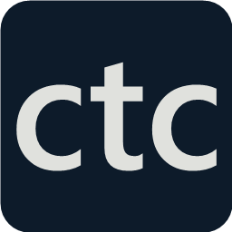

# Context-Token Codex 6.8.6



CTC is a Windows widget for Codex context, token counts, and account quotas.
Created by **Yahya Nabil** | [yahyanabil.com](https://yahyanabil.com).

**Windows 10/11 | MIT | Independent community project**

## Install

1. Download the Windows release ZIP and its SHA256 file.
2. Check the ZIP hash.
3. Extract the ZIP.
4. Open **Setup.exe**.

Setup creates shortcuts and keeps your settings.
When you install an update, CTC keeps the previous files in a backup.
Installation does not need administrator access.
Windows supplies PowerShell and .NET.
The executables are unsigned.

See [INSTALL.md](INSTALL.md) for the GitHub command and Codex installation prompt.
These methods need a public repository and release.
Publication waits for the owner's approval.

If you use source files, build the executables first:

```powershell
powershell.exe -NoProfile -ExecutionPolicy Bypass -File .\Build\build.ps1
```

Then open **Setup.exe** or **ContextWidget.exe**.
You can run CTC from an extracted folder.
Auto-open creates a Startup shortcut to that folder.
Before you move the folder, disable Auto-open.
After the move, enable Auto-open from the new location.

## Views

| View | Data and controls |
|---|---|
| Context | Active chats, recorded context percentage, and compaction status. |
| Tokens | Recorded chat totals, input, output, cached input, and reasoning. |
| Limits | Global and project context settings. Includes saved idle projects. |
| Queue | Saved limit changes, recorded confirmation, and safe restart controls. |
| Compact | One selected active chat. Use the arrows to select another chat. |
| Parked bar | Selected chat context, tokens, navigation, and account quotas. |

The quota bars appear in every view.
They show the remaining account quota.
Move the pointer over a bar to see used percentage, plan, record time, and reset time.
Select **Refresh** to read the newest account quota.

CTC reads local records.
Context is the last recorded request, not a continuous model measurement.
Token counts change when Codex writes new records.
Input includes cached input. Output includes reasoning.
The total equals input plus output.
Chat totals can include previous models.
Local totals are not account totals.

Quota estimates use recorded changes and local token data.
Other devices can affect the result.
The estimate does not measure exact quota use for one chat.
Old or unknown readings stay marked.
Compaction completion comes from session events.
The live compaction indicator needs compatible local logs.

## Edit context limits

Select **Edit context limits** in the compact view.
CTC opens the project for the displayed chat.
You can edit values at the compact size.
Save stays visible while details scroll.
Expand and Collapse keep your unsaved values.

Select a project or global scope from the list.
These settings apply to all models in that scope.
CTC does not store separate limits for each chat or model.
Saving does not change the window of a loaded chat.
CTC shows **Saved - waiting for reload** while the recorded window differs.
After all chats stop, quit Codex fully. Open Codex again. Resume the chat.
Closing one window can leave Codex running in the background.
Check for a new usage record. CTC confirms the setting only when the recorded window matches.
The usable window can be smaller than the saved value. Codex can reserve space.
**Queue**, beside **Limits**, shows saved changes and restart controls.
If a file changes outside CTC, Queue shows the original queued values and current file values.
Project overrides cannot confirm a global queue entry.
The controls stay visible while the change list scrolls.
CTC keeps the latest saved change for each settings file after it closes.
Recorded windows are per chat. Confirmation of a window does not confirm the compaction threshold.
**Restart now safely** is disabled while CTC records running chats.
**Restart after all chats stop** queues one restart. **Cancel restart** removes the waiting request.
The helper scans recent user and agent records. It waits for ten seconds of recorded idle state.
Unknown lifecycle data, incomplete records, read errors, and scan limits block the restart.
The helper requests a normal close. It does not force-stop Codex.
If Codex stays open, quit it manually. The request expires after 24 h.
The helper reopens Codex. Resume the chat. Check its next context record.
Helper maintenance preserves the request expiry. It does not create a new 24-hour request.
CTC writes settings at Save. It queues the restart, not a separate per-chat configuration.

Enter `200000`, `200k`, or `default` for the context window.
Enter tokens or a percentage for **Compact at**.
Example: `90%` of `200k` equals `180000` tokens.
A percentage needs an entered numeric window.
CTC saves the percentage as tokens.
It does not change automatically with later window settings.

Use **x1 / x2 / x3** to multiply the displayed base value.
If you select x2 then x3, the results are twice then three times the same base.
Numeric compaction thresholds keep their percentage.
Percentage input stays a percentage. `default` stays `default`.
If no base value is available, enter a numeric window first.
The base label identifies saved, inherited, catalog, or recorded data.

**80% / 90% / 95%** set a compaction percentage.
**Undo** reads the saved values again.
**Default** sets both fields to `default`.
**Save** writes the values.
Before Save, CTC does not change the settings file.
An incorrect value disables Save and shows the reason.

Larger values do not increase model capacity.
CTC shows a warning if a value exceeds the limit in the local model catalog.
Model catalog data can be old. Other models can have different limits.
Codex can reject or reduce the requested value.

Open **Saved and live values** to compare saved and recorded data.
Move the pointer over these values to see the file path.
CTC writes both limits together and keeps a backup.
It checks for file changes before the final write.
It preserves normal TOML strings and quoted keys.
If CTC cannot use the file syntax, it stops before writing.

## Window controls

Drag the header to move the widget.
Release near a corner to set the position.
Expand shows more detail. Collapse returns to the compact view.
Drag the lower right control to resize the expanded view.

| Control | Action |
|---|---|
| Background | Changes background opacity. Text stays visible. CTC saves changes immediately. |
| Pinned | Keeps CTC above other windows. |
| Corner | Selects a screen corner. |
| Tray | Hides CTC beside the Windows clock. Select the ctc icon to restore it. |
| Minus | Shows context, tokens, navigation, and small quotas in a bar at the same corner. Select its restore button to open CTC. |
| Close | Stops CTC. |

If the widget is hidden, open ContextWidget.exe again to restore it.
The icon can be in the tray's ^ menu.

## Startup and data

Auto-open is on by default.
New installations open in the small bar. Background is 85%.
Change **Open in the small bar** in Window and startup to open the full widget.
Manual restore opens the widget. Automatic app launches use the startup preference.
Widget settings can follow Codex, ChatGPT, or Either.
The watcher starts at Windows sign-in.
It checks app windows every 1.5 seconds without a fixed app version.
If the first launch fails, it tries again every 15 seconds.
After CTC is ready, Close stops it until another app launch or manual launch.
CTC stays open after the selected app closes.

Local data appear before detailed quota estimates.
An account quota request can take up to 45 seconds.
CTC uses a separate helper database for that request.
It sends only initialization and account quota requests.
CTC does not read chat text for quota calculation or change the Codex message queue.

Codex data formats can change.
Some changes need a CTC update.
See [COMPATIBILITY.md](COMPATIBILITY.md) for tested environments and remaining checks.
See [RECOVERY.md](RECOVERY.md) for repair steps.

## Writing and credits

Use STE for all new app text. See [UI-WRITING.md](UI-WRITING.md) and [AGENTS.md](AGENTS.md).
Keep the [MIT license](LICENSE) and [reference notices](THIRD_PARTY_NOTICES.md).
See [ACKNOWLEDGMENTS.md](ACKNOWLEDGMENTS.md) for source credits and exact revisions.

## Tool activity

Open a chat's **Breakdown** to see token cards. Move the pointer over a count to see its exact value.
Open **Latest request**, **Tool calls**, or **Data and estimate** for more details.
Tool calls count unique call IDs in the selected rollout record. Resumed records can cover different periods.
CTC does not keep tool arguments or results in this activity view.
Call counts do not measure token cost. Separate tool and automation token costs remain `--`.
See [USAGE-METHODS.md](USAGE-METHODS.md) for the data rules and design sources.

The source package includes [ARCHITECTURE-REVIEW.md](ARCHITECTURE-REVIEW.md) and [WORK-QUEUE.md](WORK-QUEUE.md).

Context limit tests and reload checks: [LIMITS-VERIFICATION.md](LIMITS-VERIFICATION.md).

## Tool activity

Tool calls has one full-width tile in Breakdown.
Open Exec for call results, status, time, and command types.
Open Script tools for nested tool references.
Open Shell results for reported helper results and exit codes.

A script reference does not prove execution. Loops and branches can change call counts.
Command types describe recorded requests. One request can have more than one type.
A missing result does not prove that a call is running.
Nonzero exit codes can have normal meanings. For example, search can return 1 for no match.
Reported shell results are separate from wrapper results.
CTC does not add shell results to the number of recorded tool calls.
Recorded time uses available wall times, or call-to-result spans when wall time is unavailable.
Spans include waiting. Concurrent calls can overlap. These totals are not active work hours.
CTC cannot read exact token costs for a tool or automation.
